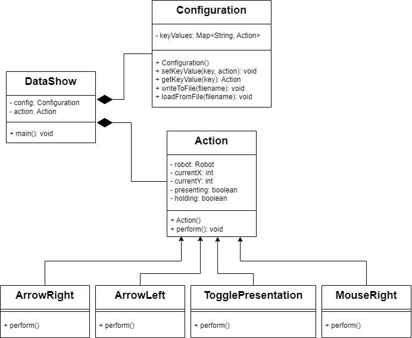

# Java Integration for Remote Control Actions

This repository contains a Java-based framework to handle remote control actions using the `Robot` class to simulate user input such as mouse movements, key presses, and screen capture. This system is designed to work with remote key signals, allowing us to automate tasks based on these signals.

## Overview

The project is divided into three primary classes:
1. **`Action`**: An abstract base class for defining various actions.
2. **`Configuration`**: Manages the mapping between remote key signals and corresponding actions.
3. **`DataShow`**: Listens for remote key signals and triggers the corresponding actions.

### Concept Overview

#### **Actions**
The system is designed to handle various types of user interactions through a set of abstract actions. Each action represents a specific operation that can be executed, such as simulating mouse movements, key presses, or other input events. The core concept is to define a framework where each action can be uniquely implemented and executed based on the needs of the system.

**Types of Actions:**
- **Mouse Actions:** These actions involve moving the mouse cursor in various directions or simulating mouse clicks and scrolls.
- **Keyboard Actions:** These actions simulate the pressing and releasing of different keys, such as arrow keys or number keys.
- **Special Actions:** Includes actions like toggling presentation mode or capturing screenshots.

#### **Configuration Management**
The system uses a configuration mechanism to map remote control signals to specific actions. This allows the system to adapt to different inputs and execute the corresponding actions based on predefined mappings.

**Configuration Features:**
- **Mapping:** Establishes connections between remote signals and their associated actions.
- **File-Based Setup:** Configuration is managed through files that define how signals correspond to actions.

#### **Signal Handling**
The system includes a component that listens for remote key signals and performs actions according to the configuration. This involves:
- **Loading Configuration:** Reading settings from a configuration file to determine the action mappings.
- **Signal Listening:** Capturing incoming remote signals and executing the mapped actions.

### "Class Diagram for DataShow Application Architecture"

This title accurately describes the content of the diagram, which showcases the structure and relationships between the different classes in Java application (`DataShow`, `Configuration`, `Action`, and its subclasses like `ArrowRight`, `ArrowLeft`, `TogglePresentation`, and `MouseRight`). The title makes it clear to the reader that this image provides an overview of the application's design. 



### Configuration File Format

The configuration file (`sudoku.txt`) should contain lines formatted as:
```
KEY: ACTION
```
Where `KEY` is the remote key signal and `ACTION` is the corresponding action class name.

## DataShow Class

The `DataShow` class listens for remote key signals and performs the corresponding actions based on the configuration.

**Key Steps:**
1. Loads the configuration from `sudoku.txt`.
2. Listens for IR key signals using the `irw` command.
3. Maps received signals to actions and performs them.

## Setup

1. **Compile the Code**

   To compile the Java code, use the following command:
   ```sh
   javac *.java
   ```

2. **Run the Application**

   Run the application with the following command:
   ```sh
   java DataShow
   ```

## Dependencies

- Java Development Kit (JDK) 8 or later
- `irw` command-line tool for capturing IR key signals

## Usage

- **Start the Application**: Execute `java DataShow` to start listening for remote key signals.
- **Configure Actions**: Edit the `sudoku.txt` file to map remote keys to actions. Ensure the file is correctly formatted.

## Troubleshooting

- **No Actions Triggered**: Verify that the `sudoku.txt` file is correctly formatted and contains the necessary mappings.
- **IR Signal Not Detected**: Ensure the `irw` tool is correctly capturing signals and that the remote control is functioning properly.
