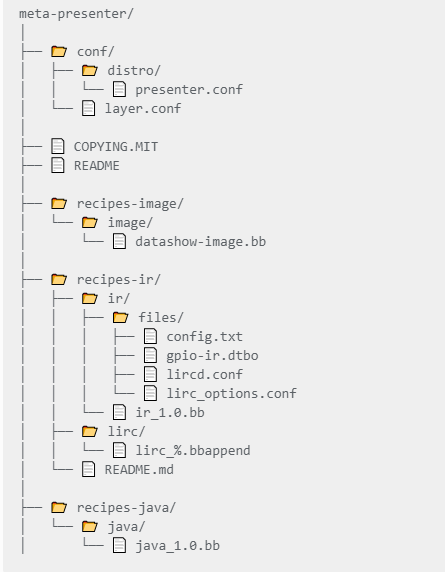

# IR Presenter for Data Show: A Yocto-Based Java Application Project

## Overview

This project focuses on developing a data show controller using an IR remote and IR sensor integrated with a Java application (IR Presenter). The goal is to create a Yocto-based Linux image (Sato with systemd) that supports this functionality. The image is based on the Yocto Kirkstone release, and the entire setup includes IR remote configuration, Java-based application integration, and a custom LibreOffice-based data show application.

## Table of Contents

- [IR Presenter for Data Show: A Yocto-Based Java Application Project](#ir-presenter-for-data-show-a-yocto-based-java-application-project)
  - [Overview](#overview)
  - [Table of Contents](#table-of-contents)
  - [Project Objective](#project-objective)
  - [Yocto Integration and Image Configuration](#yocto-integration-and-image-configuration)
    - [Heirarchy](#heirarchy)
    - [Steps Taken](#steps-taken)
  - [Java Integration via Meta-Java Layer](#java-integration-via-meta-java-layer)
    - [Steps Taken](#steps-taken-1)
  - [LIRC Integration for IR Remote Control](#lirc-integration-for-ir-remote-control)
    - [Steps Taken](#steps-taken-2)
  - [Testing IR Remote with Raspbian](#testing-ir-remote-with-raspbian)
    - [Steps Taken](#steps-taken-3)
  - [Creating Custom Overlays and DTS Compilation](#creating-custom-overlays-and-dts-compilation)
    - [Steps Taken](#steps-taken-4)
  - [Configuring the LIRCD Device Driver](#configuring-the-lircd-device-driver)
  - [Developing the Java Application](#developing-the-java-application)
    - [Steps Taken](#steps-taken-5)
  - [Integrating the Data Show Application](#integrating-the-data-show-application)
  - [Challenges and Solutions](#challenges-and-solutions)

---

## Project Objective

The goal of this project is to create an IR-controlled data show system that can be used to navigate presentation slides. The system involves several components, including hardware (IR remote, IR sensor), software (Java application for controlling the data show), and integration with a Yocto-based Linux system. The project leverages the flexibility and modularity of Yocto to build a custom Linux image tailored for this purpose.

## Yocto Integration and Image Configuration

To begin with, we needed a Linux image that supports a graphical user interface (GUI) and is based on the `systemd` initialization system. We chose the Sato image from the Yocto Project, which is compatible with the Kirkstone release. The first step was to configure Yocto to include the necessary layers and components.

### Heirarchy



### Steps Taken

1. **Configure the Build Environment**: Set up the Yocto build environment for the Kirkstone release.
2. **Include Necessary Layers**: Added the `meta-openembedded`, `meta-oe`, and `meta-java` layers to our `bblayers.conf` file:

   ```bash
   BBLAYERS += "path_to_source/meta-openembedded/meta-oe"
   BBLAYERS += "path_to_source/sources/meta-java"
   ```

3. **Configure Local and Distro Files**: Modified `local.conf` and distro configuration files to ensure compatibility with `systemd` and Sato.

## Java Integration via Meta-Java Layer

Java is central to our project as it is used for developing the IR Presenter application. We integrated Java using the `meta-java` layer provided by the OpenEmbedded community.

### Steps Taken

1. **Install the Meta-Java Layer**: Clone the `meta-java` repository and add it to the Yocto build environment.
2. **Add Dependencies**: The `meta-java` layer depends on `meta-oe`. We included this layer and ensured it was correctly referenced in `bblayers.conf`.
3. **Configure Java Providers**: Added the following configurations to the `local.conf` or distro include file:

   ```bash
   PREFERRED_PROVIDER_virtual/java-initial-native = "cacao-initial-native"
   PREFERRED_PROVIDER_virtual/java-native = "jamvm-native"
   PREFERRED_PROVIDER_virtual/javac-native = "ecj-bootstrap-native"
   ```

## LIRC Integration for IR Remote Control

To use the IR remote for controlling the data show, we integrated `LIRC` (Linux Infrared Remote Control) into our Yocto image.

### Steps Taken

1. **Identify the LIRC Package Location**: Found the `lirc` recipe in `meta-openembedded/meta-oe/dynamic-layers/meta-python/recipes-connectivity/lirc`.
2. **Enable LIRC in the Yocto Image**: Added `lirc` to `IMAGE_INSTALL` and configured necessary dependencies.

After resolving this, we were able to see `lirc0` and `lirc1` under `/dev`.

## Testing IR Remote with Raspbian

At this stage, we needed to test the IR remote with the receiver sensor to identify the required configurations. To do this, we used a Raspbian image.

### Steps Taken

1. **Set Up Raspbian Environment**: Configured the IR remote with specific button mappings to control presentation slides.
2. **Extract Configuration Files**: Once the remote was configured successfully, we extracted the configuration file to replicate it in our Yocto-based image.

## Creating Custom Overlays and DTS Compilation

After testing on Raspbian, we identified that the `gpio_ir.dts` file needed to be compiled on our host machine and added to the boot partition overlays.

### Steps Taken

1. **Compile DTS File**: Compiled `gpio_ir.dts` on the host machine.
2. **Add to Boot Overlays**: Added the compiled file to the boot partition under the `overlays` directory.

With this setup, we were able to configure the remote using the `irrecord` command on our Sato image.

---

## Configuring the LIRCD Device Driver

The LIRCD device driver has a number of handy utilities to facilitate configuring different IR remotes and use this configuration to map signal frames to defined keys.

1. First, we need to map the input pin to the gpio-ir driver that will read the signal frames:
   1. Add this line to the `/boot/config.txt` file to use pin 18 for input:

   >```txt
   > dtoverlay=gpio-ir,gpio_pin=18
   >```

2. In the `/etc/lircd/lirc_options.conf` file, ensure that the driver and device options are set as follows:

   >```txt
   ># These are the default options to lircd, if installed as
   ># /etc/lirc/lirc_options.conf. See the lircd(8) and lircmd(8)
   ># manpages for info on the different options.>
   >[lircd]
   >nodaemon        = False
   >permission      = 666
   >driver          = default
   >device          = /dev/lirc1
   >output          = /var/run/lirc/lircd
   >pidfile         = /var/run/lirc/lircd.pid
   >plugindir       = /usr/lib/lirc/plugins
   >allow-simulate  = No
   >repeat-max      = 600
   >#listen         = [address:]port
   >#connect        = host[:port]
   >#debug          = 5
   >#uinput         = ...
   >#release        = ...
   >#logfile        = ...>
   >[lircmd]
   >uinput          = False
   >nodeamon        = False
   >```

   * If your driver is using another device, use `driver = /dev/lirc0`

   * `repeat-max` defines the maximum number of signal frames read on pressing and holding a key.
     * Set as `0` if you want only one press is registered for each press and hold.

3. Use the `irrecord` utility to record your ir remote signal frames
   1. Stop the lircd service

      >```sh
      >sudo systemctl stop lircd
      >```

   2. Run the `irrecord` command as follows: `irreord [device] -d [path to store the output configuration file]`

      >```sh
      >sudo irrecord -d /dev/lirc1 ~/lircd.conf
      >```

   3. Follow the guide to record buttons from your remote control. The generated configuration file will be saved as ~/lircd.conf and it will be like that:

      >```conf
      >
      ># Please take the time to finish this file as described in
      ># https://sourceforge.net/p/lirc-remotes/wiki/Checklist/
      ># and make it available to others by sending it to
      ># <lirc@bartelmus.de>
      >#
      ># This config file was automatically generated
      ># using lirc-0.10.1(default) on Thu Apr 28 18:32:18 2022
      ># Command line used: -d /dev/lirc1 /home/root/lircd.conf
      ># Kernel version (uname -r): 5.15.92-v7l
      >#
      ># Remote name (as of config file): test
      ># Brand of remote device, the thing you hold in your hand:
      ># Remote device model nr:
      ># Remote device info url:
      ># Does remote device has a bundled capture device e. g., a
      >#     usb dongle? :
      ># For bundled USB devices: usb vendor id, product id
      >#     and device string (use dmesg or lsusb):
      ># Type of device controlled
      >#     (TV, VCR, Audio, DVD, Satellite, Cable, HTPC, ...) :
      ># Device(s) controlled by this remote:
      >
      >begin remote
      >
      >name test 
      >bits           32
      >flags SPACE_ENC|CONST_LENGTH
      >eps            30
      >aeps          100
      >
      >header       9006  4503
      >one           565  1666
      >zero          565   563
      >ptrail        573
      >repeat       9017  2234
      >gap          107682
      >toggle_bit_mask 0x0
      >frequency    38000
      >
      >      begin codes
      >         KEY_1                    0x00FFA25D
      >         KEY_2                    0x00FF629D
      >         KEY_3                    0x00FFE21D
      >         KEY_4                    0x00FF22DD
      >         KEY_5                    0x00FF02FD
      >         KEY_6                    0x00FFC23D
      >         KEY_7                    0x00FFE01F
      >         KEY_8                    0x00FFA857
      >         KEY_9                    0x00FF906F
      >         KEY_0                    0x00FF9867
      >         KEY_NEXT                 0x00FFB04F
      >         KEY_ENTER                0x00FF38C7
      >         KEY_PREVIOUS             0x00FF6897
      >         KEY_UP                   0x00FF18E7
      >         KEY_DOWN                 0x00FF4AB5
      >         KEY_LEFT                 0x00FF10EF
      >         KEY_RIGHT                0x00FF5AA5
      >      end codes
      >
      >end remote
      >
      >
      >```

4. Restart the lircd service

   >```sh
   >sudo systemctl start lircd
   >```

5. To test if LIRC is working with your remote, use the irw command:
   1. The `irw` utility command maps the input signal frame to the its defined key in the `lircd.onf` file.
   2. The output is in the form: `[entered signal in hex] [number of signals read while pressing and holding the same key] [mapped key] [configuration file name]`

   >```txt
   >0000000000e17e65 00 KEY_POWER my_remote
   >0000000000e17e65 01 KEY_POWER my_remote
   >0000000000e17e66 00 KEY_VOLUMEUP my_remote
   >```

---

## Developing the Java Application

The Java application, named "IR Presenter," was developed to interpret the remote signals and perform actions such as scrolling through presentation slides.

[Read Java Application Documentation](DataShow/README.md)

### Steps Taken

1. **Understand IR Signals**: Used `irw` to map remote signals to specific actions.
2. **Develop the Application**: Created a Java application that listens for IR signals and executes corresponding actions.

## Integrating the Data Show Application

For the data show functionality, we decided to integrate a subset of LibreOffice's presentation package.

## Challenges and Solutions

Throughout the project, we faced multiple challenges such as missing devices, `irw` command issues, and branch compatibility problems. Each challenge was addressed by thorough research, testing on alternative platforms, and collaborating as a team to parallelize tasks.
